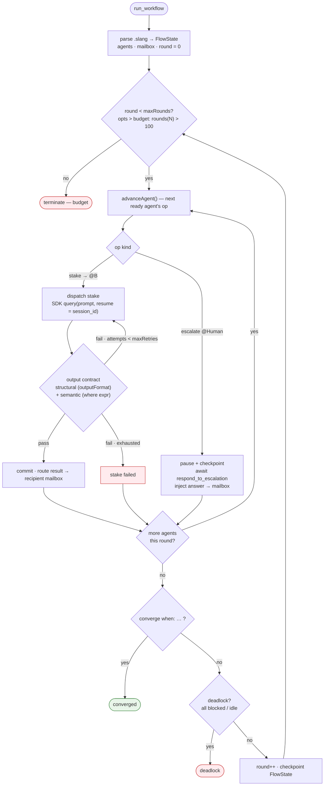

# Slang Workflows as a Claude Code MCP Server

Design for a standalone **Claude Code** (Anthropic's CLI/SDK agent) plugin that vendors the
slang **Workflow** abstraction from [**Shofer**](https://shofer.dev) — the deterministic,
`.slang`-driven, non-LLM executor — and exposes it as a **stateful MCP server** that uses the
**Agent SDK** internally for agent dispatch.

This is a feasibility-and-design doc for a standalone plugin. The slang executor was originally
built for [**Shofer**](https://shofer.dev), the AI-agent VS Code extension; here it is vendored
and ported to Claude Code. The plugin's own language spec — a **fork** of Shofer's slang spec,
with plugin extensions — is [`slang_specs.md`](slang_specs.md) in this folder.

> **Related**
>
> - Origin: [**Shofer**](https://shofer.dev) — the AI-agent VS Code extension the slang executor was first built for.
> - Language spec: [`slang_specs.md`](slang_specs.md)
> - Sibling design (same plugin pattern, different feature): the sibling live-memory plugin design
> - Claude Code subagents: https://docs.claude.com/en/docs/claude-code/sub-agents
> - Agent SDK: https://docs.claude.com/en/docs/claude-code/sdk/sdk-headless

---

## Implementation Status

> A working implementation lives in [`server/`](server) — a **standalone Claude Code plugin**
> (no upstream dependency; the slang VM is vendored). Verified with a mock-based unit suite **and**
> real Agent SDK model calls. Install/usage: [`README.md`](README.md).

| Capability | Status | Verified by |
|-----------|--------|-------------|
| Vendored slang VM (lexer/parser/resolver/interpreter) | ✅ | typecheck |
| `list_workflows` / `validate_workflow` | ✅ | real `.slang` files |
| Executor loop: stake → contract → route → commit → converge | ✅ | unit + real |
| Structural output contract (`output:` via SDK `outputFormat`) | ✅ | unit + real (`structured_output`) |
| Semantic output contract (`where <expr>`) | ✅ | unit + real |
| Tool-group → Claude Code tool mapping | ✅ | unit |
| `run_workflow` — by name/path **or inline `source`**, synchronous **or `background:true`** | ✅ | real model calls + unit |
| Inline `source` gate (parse + static errors) · `get_slang_grammar` (LLM-generated flows) | ✅ | unit + MCP smoke |
| `get_workflow_state` / `get_topology` / `get_trace` (Mermaid sequenceDiagram + event log) | ✅ | unit |
| Multi-agent stake routing | ✅ | unit + real (21 → doubled to 42) |
| Session resume (one agent = one session across stakes) | ✅ | real (recalled a secret across stakes) |
| `escalate @Human` executor logic | ✅ | unit (fake handler) |
| `escalate @Human` via MCP elicitation | ✅ mechanism verified | scripted MCP client round-trips `elicitInput` on `08-escalation` (both branches → `approved`/`rejected`) — `server/test/elicitation-live.mjs`; live Claude Code UI rendering still worth a manual look |

**Deviations from the design below, discovered during implementation:**

- **Output-contract Layer 1 is `outputFormat`, not a strict tool.** In-process SDK MCP tools
  expose no `strict` flag, so a hard token-level `submit_result` is not achievable on the SDK
  path — see [§ Output Contract Enforcement](#output-contract-enforcement). The honest ceiling is
  soft + retry.
- **`run_workflow` runs synchronously by default; `background:true` is now available** — it
  returns a `workflow_id` immediately and the run is polled live via `get_workflow_state` /
  `get_topology` / `get_trace` (the executor exposes its live `FlowState` via an `onStart` hook).
  Interactive `@Human` escalation works in **synchronous** runs only, because MCP elicitation
  must happen within the open `run_workflow` call.
- **The slang stack is a vendored fork** under `server/src/slang/`, scrubbed of upstream
  references and extended with the `where` clause.

**Not yet implemented:** parallel stake dispatch, a push/subscription event API
(`await_workflow_event` — background runs are **polled** today, not pushed), `step_workflow` /
`abort_workflow`, plugin packaging/persistence (Phase 5). (Background execution and the
sequence/trace view — formerly `get_sequence` — now ship as `background:true` + `get_trace`.)

---

## Table of Contents

1. [Motivation](#motivation)
2. [The Central Invariant: Operator Mode](#the-central-invariant-operator-mode)
3. [Why an MCP Server + Agent SDK](#why-an-mcp-server--agent-sdk)
4. [Architecture](#architecture)
5. [Component Mapping: Upstream → MCP Server](#component-mapping-upstream--mcp-server)
6. [MCP Tool Surface](#mcp-tool-surface)
7. [Long-Running Execution & MCP Timeouts](#long-running-execution--mcp-timeouts)
8. [Escalate @Human → Pause/Resume](#escalate-human--pauseresume)
9. [Inner-Agent Permissions](#inner-agent-permissions)
10. [Visualization via Mermaid](#visualization-via-mermaid)
11. [Two-Layer Context Discipline](#two-layer-context-discipline)
12. [Output Contract Enforcement](#output-contract-enforcement)
13. [Language Choice](#language-choice)
14. [What Changes vs. the Shofer Design](#what-changes-vs-the-shofer-design)
15. [Implementation Phases](#implementation-phases)
16. [Open Questions](#open-questions)
17. [References](#references)

---

## Motivation

Shofer's slang Workflow abstraction solves a real problem: LLM-driven orchestration
(Shofer's Orchestrator mode) is non-deterministic — the LLM may skip steps, forget the
review loop, or terminate early. The **Workflow** introduces a **formal, non-LLM-driven
executor** (`WorkflowTask.slangLoop()`) that reads a `.slang` specification and dispatches
agents as background Tasks. The executor is a deterministic state machine — it makes
**zero LLM calls itself**.

We want this capability available inside **Claude Code**, so the same provable,
deterministic multi-agent workflows run there — not just inside Shofer's VS Code
extension. The design question: *which Claude Code surface can host a non-LLM-driven
executor while keeping the user in the familiar CLI?*

---

## The Central Invariant: Operator Mode

There are two ways the top-level Claude session can relate to a workflow. **Only one
preserves what `.slang` is for**, and this doc assumes it throughout:

| Mode | Who runs the coordination logic? | Deterministic? | Verdict |
|------|----------------------------------|----------------|---------|
| **Operator** ✅ | The MCP server's slang interpreter. The top-level Claude agent only *triggers* (`run`/`step`) and *observes* (`get_state`/`get_topology`). | ✅ Yes — the VM is a pure state machine | **This is `.slang`** |
| **Driver** ❌ | The top-level Claude agent calls fine-grained primitives (`dispatch_agent`, `route_mailbox`, `eval_converge`) and decides the order itself. | ❌ No — an LLM is back in the coordination seat | Just upstream LLM-driven orchestration with extra steps |

> **Invariant:** *The slang interpreter runs inside the MCP server and makes zero LLM
> calls of its own. The top-level Claude session never makes a coordination decision.*
> If a future change lets the top-level agent pick the next operation, choose routing,
> or decide convergence, the determinism guarantee is void — that is the Driver trap.

---

## Why an MCP Server + Agent SDK

Claude Code's plugin primitives are evaluated against the two hard requirements: (1) a
deterministic, non-LLM executor, and (2) a long-lived process that owns workflow state.

| Primitive | Lifecycle | Hosts a deterministic loop? | Owns persistent state? | Verdict |
|-----------|-----------|-----------------------------|------------------------|---------|
| **Skill** | Loaded into a turn's context | ❌ It's a prompt | ❌ No | Wrong shape |
| **Subagent** | Fresh context per spawn; an LLM | ❌ It *is* an LLM | ⚠️ Transcripts persist | Defeats determinism |
| **Hook** | Fires on an event, runs a command, exits | ❌ No loop | ❌ No | Useful as a feeder, not the brain |
| **MCP server** | **Long-running process, owns arbitrary state** | ✅ **Yes** — your code is the loop | ✅ **Yes** | ✅ **The host** |

Only the MCP server is a stateful, long-lived, queryable process that can run a
deterministic VM. The Agent SDK is the dispatch primitive *inside* that server: each
slang agent becomes an SDK session, and each `stake` becomes a `query()` call.

### Why not a pure Agent SDK app (no MCP)?

A standalone SDK program works ([the executor ports cleanly](#component-mapping-upstream--mcp-server)),
but the user leaves the Claude Code CLI — the "UI" is stdout or a separate web dashboard,
and the upstream integrated visualization does not carry over. Wrapping the executor in an
MCP server means:

- **The user stays in the CLI.** The top-level Claude agent runs/observes workflows via
  tools, exactly like any other MCP-backed capability.
- **`escalate @Human` flows through the normal conversation.** The top-level agent asks
  the user in the familiar surface; no special UI.
- **Visualization is near-free via Mermaid.** Claude Code renders Markdown/Mermaid inline,
  so topology and sequence diagrams render with no webview.

### Why not the Driver mode (fine-grained primitives)?

Exposing `dispatch_agent` / `route_mailbox` / `eval_converge` as individual tools and
letting the top-level Claude agent orchestrate them re-introduces the exact
non-determinism `.slang` was designed to eliminate. Reject.

---

## Architecture

```
┌─ Claude Code CLI (user's familiar session) ──────────────────┐
│  top-level Claude agent                                       │
│   • calls MCP tools: run / step / get_state / get_topology …  │
│   • relays escalate @Human questions to the user              │
│   • renders Mermaid diagrams inline                           │
└────────────────────────────┬──────────────────────────────────┘
                             │ MCP (stdio or http transport)
                             ▼
┌─ slang-mcp-server (long-running process) ────────────────────┐
│                                                               │
│  Deterministic executor (ported from upstream, verbatim):     │
│   slang-lexer / slang-parser-upstream / slang-resolver        │
│   slang-interpreter (advanceAgent, routeOutput, evalExpr)     │
│   FlowState + mailbox + converge/budget                       │
│                                                               │
│  Agent dispatch layer (Agent SDK):                            │
│   each slang agent = one SDK session (session_id)             │
│   stake = query(prompt, resume=session_id) → ResultMessage    │
│   parallel stakes = asyncio.gather over ready agents          │
│                                                               │
│  Exposed MCP tools (see § MCP Tool Surface):                  │
│   run_workflow / step_workflow / get_workflow_state           │
│   get_topology / get_sequence / get_agent_transcript          │
│   respond_to_escalation / abort_workflow                      │
│                                                               │
│  Persistence:                                                 │
│   FlowState checkpoint (sidecar JSON) + SDK session JSONL     │
└───────────────────────────────────────────────────────────────┘
```

That box is the **component** view. The executor's **per-round control flow** — the state
machine that makes coordination deterministic (zero LLM calls in the loop itself) — is:



Each **stake** is dispatched to the agent's own SDK session (`resume = session_id`, so it keeps
its history across rounds); the result is validated against the output contract — **structural**
(`outputFormat`) then **semantic** (`where`) — and a failure re-prompts the *same* session up to
`MAX_RETRIES` before the stake is marked failed. Convergence, deadlock, and budget are evaluated
at round boundaries, and `FlowState` is checkpointed each round so a run survives restarts.

The slang stack is framework-agnostic TypeScript. The interpreter's own header states
the portability contract explicitly:

> *"Every function in this module takes all state as explicit parameters and has zero
> dependencies on the host provider, Task, TaskManager, or any VS Code API. This makes the
> core VM (advanceAgent, evalExpr, mailbox routing, convergence) unit-testable with
> plain data fixtures."*
> — `slang-interpreter.ts`

Only the **dispatch layer** changes: the upstream `Task`/`new_task`/`wait_for_task` →
SDK `query()`/`resume`. The parser, resolver, interpreter, and runtime types are vendored as a
**near-verbatim fork** in this folder — identical to the upstream implementation except for a small set of
clearly-marked plugin extensions (currently the output-contract [`where` clause](#output-contract-enforcement)).

---

## Component Mapping: Upstream → MCP Server

| Upstream module | MCP server equivalent | Port effort |
|---------------|----------------------|-------------|
| `slang-lexer.ts` | `server/slang/lexer.ts` | **Verbatim** — vendored, no deps |
| `slang-parser-upstream.ts` | `server/slang/parser.ts` | **Verbatim** |
| `slang-parser.ts` | `server/slang/index.ts` | **Verbatim** — public API (`parseSlang`, `validateSlangAST`) |
| `slang-resolver.ts` | `server/slang/resolver.ts` | **Verbatim** — dep graph, deadlock detection |
| `slang-interpreter.ts` | `server/slang/interpreter.ts` | **Verbatim** — pure VM |
| `slang-types.ts` | `server/slang/types.ts` | **Verbatim** — `FlowState`, `AgentState`, `MailboxEntry`, (de)serializers |
| `slang-ast.ts` | `server/slang/ast.ts` | **Verbatim** — AST type definitions |
| `WorkflowTask.ts` | `server/executor.ts` | **Rewrite dispatch layer** — `slangLoop` structure stays; `spawnAgentTask`/`wait_for_task` → SDK `query()`/`resume`. VS Code-specific viz methods dropped. |
| `wait-for-task-helper.ts` | (absorbed into `executor.ts`) | Simplified — SDK `query()` is already an awaitable generator |
| The upstream `Task` (per agent) | SDK session (`session_id`) | One agent = one session for its lifetime (see below) |
| `messageQueueService.addMessage()` (resume) | `query(prompt, options={resume: session_id})` | Resume the same session with full history |
| `attempt_completion` result | `submit_result` tool-call args (preferred) or `ResultMessage.result` | Strict-tool args give a hard structural guarantee; see [§ Output Contract Enforcement](#output-contract-enforcement) |
| `HistoryItem` (`slangSource`, `flowState`) | Sidecar `flowState.json` per workflow | Disk checkpoint per round |
| `escalate @Human` | Pause loop + `respond_to_escalation` tool | See [§ Escalate](#escalate-human--pauseresume) |
| `WorkflowView` / `TaskSelector` / custom `.slang` editor | **Dropped**; Mermaid via `get_topology`/`get_sequence` | See [§ Visualization](#visualization-via-mermaid) |

### Agent-as-session: the long-lived-task question

A slang agent is **long-lived**: the executor sends multiple stakes into it across rounds,
and it must retain conversation history (the Developer remembers round-1 work when
addressing round-2 review feedback). This maps to **one SDK session per agent for its
entire lifetime**, resumed across stakes:

| Upstream (today) | MCP server (Agent SDK) |
|----------------|------------------------|
| One slang agent = **one `Task` instance** | One slang agent = **one `session_id`** |
| Stake = `messageQueueService.addMessage(prompt)` → wait for `attempt_completion` | Stake = `query(prompt, resume=session_id)` → wait for `ResultMessage` |
| Between stakes: Task dormant in memory | Between stakes: session stopped, state on disk (JSONL) |
| Resume = wake dormant Task via queue | Resume = `query(..., resume=session_id)` |
| History accumulates (same Task) | History accumulates (same session) |

Functionally identical. The only difference is the storage medium: the upstream implementation keeps the Task
object in memory; the SDK keeps the session on disk. The disk-backed version is *more*
durable (survives crashes/restarts) — the upstream implementation already checkpoints `FlowState` to
`HistoryItem` for the same reason.

```typescript
// Pseudocode: one slang agent = one SDK session, resumed per stake
const agentSessions = new Map<string, string>(); // agentName -> session_id

async function runStake(agentName: string, prompt: string): Promise<string> {
  const opts = agentOptions(agentName); // tools, model, permissionMode from .slang meta
  if (!agentSessions.has(agentName)) {
    // First stake → fresh session, capture the ID from the init message
    for await (const msg of query({ prompt, options: opts })) {
      if (msg.type === "system" && msg.subtype === "init") {
        agentSessions.set(agentName, msg.data.session_id);
      }
      if (msg.type === "result") return msg.result; // ← attempt_completion output
    }
  } else {
    // Subsequent stakes → RESUME the same session, full history intact
    for await (const msg of query({
      prompt,
      options: { ...opts, resume: agentSessions.get(agentName) },
    })) {
      if (msg.type === "result") return msg.result;
    }
  }
}
```

> **Stop-and-resume by default; mid-turn parking is possible via a blocking tool.** An SDK
> `query()` normally runs to completion then stops, and that is the default model here: a
> stake is a discrete, terminal operation — the agent works, calls `attempt_completion`
> (stops), the executor captures the result and resumes for the next stake. There *is*,
> however, one way to park a *running* query mid-turn: a **blocking in-process tool handler**
> (an `await`-ing custom tool) holds the turn open at the tool call until an external promise
> resolves — and because the SDK pauses between turns, no API request is open during the wait,
> so streaming idle timeouts don't apply. This is exactly the primitive that
> [option (c) for agent-initiated questions](#escalate-human--pauseresume) uses. The caveat:
> the wait's upper bound past `API_TIMEOUT_MS` (default 10 min) is **undocumented**, so
> mid-turn parking is for interactive waits, not durability — crash-safe pausing still uses
> stop-and-resume + checkpoint.

---

## MCP Tool Surface

The server exposes a control/observation surface. All tools take a `workflow_id`; the
server keys workflow state by `cwd` for multi-workspace isolation (same pattern as the
sibling live-memory plugin design).

### Control

| Tool | Purpose |
|------|---------|
| `list_workflows` | Discover `.slang` files in `.claude/workflows/` (project) and `~/.claude/workflows/` (global). Returns name, title, params, agent count. |
| `validate_workflow` | Parse + static analysis (`validateSlangAST`) — returns diagnostics without running. |
| `run_workflow` | **Start** the loop as a background task; return immediately with `workflow_id` + initial state. Does **not** block (see [§ Long-Running](#long-running-execution--mcp-timeouts)). |
| `step_workflow` | Advance N units (`granularity: "round" \| "stake"`), checkpoint, return new state. |
| `respond_to_escalation` | Deliver the user's answer to a paused `escalate @Human`; resume the loop. |
| `abort_workflow` | Cancel the loop + all in-flight agent sessions. |

### Observation

| Tool | Purpose |
|------|---------|
| `get_workflow_state` | Serialized `FlowState`: agent statuses, opIndex, `sendingTo`/`waitingFor`, bindings, round, budget usage, flow status. |
| `get_topology` | Current-round topology as a **Mermaid string** (nodes + live edges). See [§ Visualization](#visualization-via-mermaid). |
| `get_sequence` | Message-passing chronology from `mailboxHistory` as a Mermaid `sequenceDiagram`. |
| `get_agent_transcript` | The **last `tail` messages** of one agent's SDK session JSONL. `tail` is a **required** parameter — there is no full-transcript fetch. Deep inspection only; **not** for routine use — see [§ Two-Layer Context](#two-layer-context-discipline). |
| `get_workflow_events` | Tail of round/step events since a cursor (for polling after `run_workflow`). |
| `await_workflow_event` | **Blocking** long-poll: returns when the next event (round complete, escalation, agent question, terminal) arrives. The top-level agent loops on this; it is also the **open request context the server elicits within** for `escalate @Human` and `ask_human` (MCP elicitation is tool-call-scoped — see [§ Escalate](#escalate-human--pauseresume)). |

---

## Long-Running Execution & MCP Timeouts

A workflow run can take many minutes. A blocking MCP tool call that runs to completion is
impractical — the upstream MCP default is a 60s per-call timeout. The pattern:

1. `run_workflow` **starts** the slang loop as a background task inside the server process
   and returns immediately with a `workflow_id` + initial `FlowState`.
2. The slang loop runs **independently** (the server is a long-lived process that owns it),
   checkpointing `FlowState` to disk each round (same as the upstream `persistCheckpoint()`).
3. The top-level agent observes via `get_workflow_state` / `get_workflow_events`, or the
   server pushes round events via **MCP notifications** (server→client).

This mirrors exactly how the upstream `WorkflowTask` runs its loop independently of the VS Code
UI. The MCP server is the long-running process; the tools are the observation/control
surface.

> **Step granularity.** You can step at the *round* or *stake* level (dispatch an agent,
> wait for its `ResultMessage`, route the result). You **cannot** single-step the internal
> LLM turns of one agent — an SDK `query()` runs its agent loop to completion. Round/stake
> is the natural slang granularity anyway (a stake is an atomic unit terminated by
> `attempt_completion`), so this is not a real loss.

---

## Escalate @Human → Pause/Resume

MCP tools are request/response — they cannot pop a user prompt mid-call. When the slang
loop reaches an `escalate @Human` operation:

1. The loop **pauses**, checkpoints `FlowState`, and the observing tool returns a
   `paused: awaiting_human_input` state carrying the escalation `reason`, `choices:`, and
   `form:` (per the [escalate grammar](slang_specs.md)).
2. The top-level Claude agent sees the paused state and asks the user through its **normal
   conversation** (the familiar CLI surface) — the same surface it uses for any
   `AskUserQuestion`.
3. The user answers; the agent calls `respond_to_escalation(workflow_id, answer)`.
4. The loop resumes, feeding the answer as the `@Human` await result into the awaiting
   agent's mailbox.

The top-level Claude agent *becomes* the human-interaction surface for escalations — the
role the upstream `WorkflowView` played. No special UI needed.

> **Agent-initiated `ask_followup_question`** (e.g., the Developer needs clarification
> mid-stake) is the dynamic analogue. Upstream this routes to the parent executor via
> `relayChildQuestion`. The inner SDK session
> runs autonomously and cannot pop its own interactive prompt, so the question must cross
> back to the human. Three options, in increasing fidelity:
>
> - **(a) Encode assumptions (simplest).** System-prompt agents to *not* ask and instead
>   record assumptions in their result. Zero machinery; lossy.
> - **(b) Question-shaped result → pause.** The agent terminates the stake with a
>   question-shaped result; the executor pauses like an escalation and re-dispatches via
>   `resume` with the answer. Durable (checkpointed), but loses mid-turn context and relies
>   on brittle result-shape sniffing.
> - **(c) A real `ask_human` tool that crosses the boundary (recommended target).** Give the
>   inner agent an in-process SDK tool — `ask_human`, **replacing** the upstream
>   `ask_followup_question` — whose handler **blocks** until a human answers, parking the
>   inner `query()` mid-turn with full context intact. The question is surfaced to the user
>   via **MCP elicitation**, which Claude Code supports natively (verified): the server
>   presents a schema-driven dialog (**form mode**) or browser flow (**URL mode**), and the
>   user's response returns across the boundary to unblock the handler. The agent resumes
>   from exactly where it paused. This is the faithful analogue of `relayChildQuestion`.
>
> **Verified constraints on (c):**
>
> - **Elicitation is supported but tool-call-scoped (MRTR pattern).** Per the
>   [MCP spec](https://modelcontextprotocol.io/specification/draft/client/elicitation) and
>   [Claude Code MCP docs](https://code.claude.com/docs/en/mcp), a server may elicit *"during
>   the processing of a client request"* — it **cannot** push a dialog from a detached
>   background loop. So the server must be inside an **open outer tool call** to elicit.
>   Anchor it with a **blocking long-poll tool** (e.g. `await_workflow_event`) that the
>   top-level agent keeps calling; when an inner agent asks, the server elicits *within* that
>   open call, then returns the next event. The slang `escalate … form:` schema maps directly
>   onto an elicitation **form-mode** JSON Schema.
> - **The blocking-handler wait is architecturally sound but undocumented past the API
>   timeout.** While the `ask_human` handler awaits, no inner API request is open (the SDK
>   pauses between turns), so streaming idle timeouts don't apply; the only inferred bound is
>   `API_TIMEOUT_MS` (default 10 min), which the inter-turn gap likely escapes — but this is
>   **inferred, not documented.** Keep (b)'s terminate-and-resume as the **durability
>   fallback** for crash-safety and for waits that may exceed the SDK's tolerance.
> - **Don't use MCP `sampling`** — deprecated in the MCP spec as of 2026-07-28; not a channel
>   for this.
>
> **Phasing:** ship (a) through Phase 1–2; implement (c) in **Phase 3 alongside `escalate`**
> (it reuses the same pause + `respond_*` / elicitation machinery); fall back to (b) where
> durability matters more than mid-turn context.

---

## Inner-Agent Permissions

The slang agents run as SDK `query()` sessions **inside** the server, with their **own**
permission model. They do **not** inherit the top-level session's interactive approval
prompts — they are autonomous, fire-and-forget. So their permission posture must be
correct at spawn time:

| `.slang` agent meta | SDK option | Notes |
|---------------------|------------|-------|
| `mode: "code"` | (provides identity; maps to a system prompt + tool set) | The upstream modes don't exist in Claude Code — map to a Claude Code subagent definition or an inline `AgentDefinition`. |
| `tools: [write, execute, read]` | `allowed_tools` / `disallowedTools` | Map the 9 ToolGroup names to Claude Code tool names (`Read`, `Edit`, `Write`, `Bash`, `Glob`, `Grep`, `WebSearch`, …). Restriction-only semantics carry over. |
| `api_configuration: "sonnet"` | `model` (`sonnet`/`opus`/`haiku`/full ID) | Per-agent model selection. |
| `role: "…"` | `AgentDefinition.prompt` | Layered onto the base system prompt. |
| (write/execute agents) | `permission_mode: "acceptEdits"` or scoped `bypassPermissions` | Inner agents are autonomous — set this explicitly and scope by workspace. |

> **This is the one place the model differs meaningfully from upstream.** The upstream agent
> Tasks share the extension's interactive approval flow; SDK inner sessions are
> fire-and-forget. Set permissions explicitly, scope by workspace, and the slang
> `tools:`/`context` declarations are precisely the mechanism for this.

### Filesystem Sandboxing (optional, agent-level)

Inner agents are autonomous and may run `Bash`. Tool *permissions* gate **which** tools run,
but **not what an allowed `Bash` command may write** (verified — permission rules and
sandboxing are complementary, per the
[SDK permissions docs](https://code.claude.com/docs/en/agent-sdk/permissions)). So an optional
**agent-level** sandbox confines each inner session's filesystem **writes** to a single root —
**default: the top-level Claude Code session's `cwd` (the workspace)**. This is whole-session
confinement (the agent process *and every `Bash` child*), **not** per-command rewriting.

**Use Claude Code's native sandbox — don't ship a custom mechanism.** Claude Code already
provides OS-level sandboxing, so the design adopts it directly rather than bringing its own
Landlock/bubblewrap wrapper:

- Enable `sandbox.enabled` for each inner session (loaded via `settingSources: ["project"]`),
  and set the session `cwd` to the writable root (default: the top-level workspace).
- Linux uses **bubblewrap** (+ `socat`); macOS uses **Seatbelt**. The default write scope is
  already *cwd + `$TMPDIR`* with network deny-all — which matches the goal out of the box.

**Why per-agent confinement works.** The Agent SDK spawns each `query()` as a separate child
**process with its own PID**, and the native sandbox is enforced **per process (and its
descendants)** — so every inner session carries its **own independent** sandbox; different
agents can have different writable roots with no cross-contamination. It is **process-level
(PID), not thread-level**: the SDK is multi-process, which is exactly what makes per-agent
sandboxing possible. The MCP server (parent) stays unsandboxed — it must write checkpoints.

> **Verified constraints.** The native sandbox is **not** configurable per-`query()` through SDK
> options (there is no `sandbox` field); enable it via project settings + `settingSources`. It
> spans **Linux / macOS / WSL2** (the user-facing scope here is Linux), and on Linux **requires
> `bubblewrap` + `socat` installed** — where they are absent the sandbox is simply unavailable
> (the feature is optional, so this degrades to "no sandbox", not an error). `permission_mode` /
> `allowedTools` do **not** substitute for it (they gate tool *use*, not write *paths*).

---

## Visualization via Mermaid

Claude Code renders Markdown, including Mermaid, inline in the terminal/UI. This recovers
most of the upstream visualization value with **no webview**:

| Upstream view | MCP server equivalent | Effort |
|-------------|----------------------|--------|
| Topology (current-round graph) | `get_topology` → Mermaid `flowchart` (nodes + live `sendingTo`/`waitingFor` edges) | Low — port `topologyToMermaid()` logic |
| Sequence (message chronology) | `get_sequence` → Mermaid `sequenceDiagram` from `mailboxHistory` | Low — data already enriched with tokens/cost/duration |
| Swimlane (per-agent control flow) | (no clean Mermaid equivalent) | Deferred — would need a web dashboard if wanted |
| Runtime overlays (active-edge pulse, opIndex marker) | Mermaid node styling + status labels | Partial — Mermaid can color nodes by status; animations are lost |

The topology and sequence diagrams are the highest-value views, and both port to Mermaid
cheaply. The custom SVG swimlane (`slang-render.js`)
does not translate to Mermaid cleanly — if swimlanes/runtime overlays are needed later,
that is where a small web dashboard would go, but it is not needed on day one.

---

## Two-Layer Context Discipline

There are now two LLM context layers:

| Layer | Owner | Should contain |
|-------|-------|-----------------|
| **A. Top-level Claude session** (user ↔ Claude) | Claude Code | **Lean** — workflow summaries, state snapshots, Mermaid diagrams. Not raw transcripts. |
| **B. Inner slang agent sessions** (one per agent) | The MCP server (via SDK) | Full agent conversation history; grows across stakes. |

Keep Layer A lean. `get_agent_transcript` exists for deep inspection but should **not** be
called routinely — it would flood the top-level context. To make flooding hard *by
construction*, the tool takes a **mandatory `tail` parameter** (return only the N most recent
messages); there is deliberately no "fetch the whole transcript" form. This is identical to
the upstream rule that the executor only reads `attempt_completion` results, never task internals
(the upstream workflow design § Executor↔Task Communication).

---

## Output Contract Enforcement

The upstream `.slang` output contracts (a stake's `attempt_completion` must match a declared
schema) carry over — but the enforcement mechanism is **different on the SDK path**, and is
best modeled as **two independent layers**, because Claude Code exposes two distinct
features that guarantee different things. The design uses **both**.

### The two layers

| Layer | Guarantees | Mechanism | Hard or soft? |
|-------|-----------|-----------|---------------|
| **1. Structural** — shape: types, `required`, `enum`, nesting | The result object is *well-formed* per the schema | Token-level **constrained decoding** | **Hard** — a malformed shape physically cannot be emitted |
| **2. Semantic** — meaning: cross-field consistency, referential validity, ranges, "did it actually answer" | The result is *correct*, not just well-shaped | Executor validates the captured result, **resume-retries on failure** | **Soft** — best-effort + bounded retry |

JSON Schema can encode Layer 1 but **not** Layer 2: a structurally valid
`{ total: 100, items: [{ amount: 30 }] }` passes the grammar even though the items don't sum
to the total. The two layers are complementary, not redundant.

### Layer 1 on the SDK path — `outputFormat` (the strict-tool path is not available)

> **Implementation finding (verified against the installed SDK `@anthropic-ai/claude-agent-sdk`).**
> The original plan was a `strict: true` `submit_result` tool for a *hard, token-level*
> structural guarantee. That is **not achievable** on the Agent SDK path: in-process SDK MCP
> tools (`createSdkMcpServer` / `tool()`) expose only `annotations`/`searchHint`/`alwaysLoad`
> — **no `strict` flag** — and the SDK provides no pass-through for raw-API constrained tool
> decoding. So there is no token-level structural tier here.

What the SDK *does* provide is `Options.outputFormat`:

| SDK surface | Mechanism | Guarantee | Status |
|-------------|-----------|-----------|--------|
| `outputFormat: { type: "json_schema", schema }` → result's `structured_output` | **Post-hoc** validate + re-prompt; on exhaustion → `error_max_structured_output_retries` | **Soft** (retry loop) | ✅ implemented + real-tested |
| A `strict: true` `submit_result` tool (constrained decoding) | token-level | **Hard** | ❌ not exposed by the SDK |

So the contract terminus is **`outputFormat`**, not a terminal tool:

- The executor compiles the slang `output:` contract to JSON Schema (`contractToJsonSchema()`,
  `additionalProperties:false` + all fields `required`) and passes it as the dispatcher's
  `outputJsonSchema`; the dispatcher sets `outputFormat` and returns the validated
  `structured_output` as `StakeResult.structured`.
- The executor **prefers** `structured` (SDK-validated) and falls back to parsing the result
  text only when it is absent (e.g. the `FakeDispatcher`).
- This is the SDK's **structural** enforcement (post-hoc + re-prompt), beneath the executor's
  own structural check and the Layer-2 `where` semantic check — defense in depth, but the
  honest ceiling on the SDK path is **soft + retry**, not a decode-time barrier.

### Layer 2 — the executor's semantic validator (resume-retry)

Layer 2 runs the contract's **semantic** checks — the invariants a JSON Schema can't express
(cross-field consistency, ranges, "did it actually answer"). But **where are those invariants
written?** Slang today has no place for them: the `.slang` `output:` contract is **structural
only** — `{ field: "type", … }`, enforced at the prompt level and validated by JSON-parse +
field-presence ([`slang_specs.md` § Structured Output Contracts](slang_specs.md)).
There is no construct for `sum(items) == total`.

**Decision — a declarative `where` clause on the contract.** Extend the contract grammar with
an optional boolean expression over the result fields:

```slang
stake review(draft: design) -> @Decider
  output: { approved: "boolean", score: "number" } where score >= 0 && score <= 100
```

The existing `output_schema` production gains a trailing clause —
`[ 'output' ':' output_schema [ 'where' expr ] ]` — where `expr` is the **same expression
grammar** already used by `if` / `when` / `converge` / `budget`. It is therefore evaluated by
the interpreter's existing **`evalExpr`** against the parsed result object (whose fields are
already dot-accessible, e.g. `review_result.approved`) — no new evaluator, no new value model.
The `where` check runs **after** the structural schema check, and a false result is treated
exactly like a structural failure (below). Pure expressions only — **no I/O**.

> **The slang stack is vendored as a fork — `where` lives in the plugin, not upstream.** The
> plugin keeps its **own** copy of the slang spec and stack in this folder
> ([`slang_specs.md`](slang_specs.md) § Semantic Assertions). The vendored lexer/parser/
> interpreter start identical to the upstream implementation and diverge only for clearly-marked extensions like
> `where`, so the upstream shared spec stays untouched. Trade-off: the fork can drift from upstream
> slang — keep extensions few, marked `(* slang-workflows extension *)`, and reconcile
> periodically.

**Escape hatch — host predicates.** Invariants that need I/O ("the cited file exists", "the URL
resolves") can't be pure `evalExpr` expressions. For those, register a host-side predicate in
the executor keyed by agent/contract. Not declarative; use only where `where` can't reach.

On failure (a false `where` **or** a failed host predicate), the executor **resumes the same
agent session** (`query(prompt, resume=session_id)`) with the *specific* violation as feedback,
bounded by `MAX_RETRIES` — upstream increments `retryCount`, re-prompts, and leaves `opIndex` on
the same stake, the exact path a structural failure already takes. Because Layer 1 guaranteed
shape, Layer 2 only ever sees well-formed objects and asserts *meaning*.

> **Don't re-check structure in Layer 2.** Re-validating types/required fields the strict
> schema already guarantees pays retries twice for one failure class and muddies telemetry.
> Layer 2 asserts semantics only.

### Failure modes to handle

- **Contract never produced** — `error_max_structured_output_retries` (if `outputFormat` is
  used) or the strict `submit_result` tool simply never being called. Treat as a stake
  failure, **not** a success-with-empty-result.
- **`error_max_turns` / empty result** — the agent burned its turn budget without
  terminating; the stake has no valid contract output. Surface as a failed stake to the slang
  loop (which already handles failed stakes).
- **Model-fallback retraction** — an automatic model fallback can retract an
  already-validated output mid-stream; if no retry replaces it, the run still ends in
  `error_max_structured_output_retries`. Check the result's `errors` field to distinguish
  "schema too hard" from "fallback retraction"
  ([Agent SDK docs](https://code.claude.com/docs/en/agent-sdk/structured-outputs)).

### Models

Both layers are supported on Opus 4.8 / 4.7 / 4.6 / 4.5, Sonnet 4.6 / 4.5, Haiku 4.5, and
Mythos / Fable 5.

> **Note:** This supersedes the earlier framing (and the stale tier table in the upstream
> output contract enforcement doc §4.2) that classified Claude as "semantic-only, no hard tier." Anthropic has since shipped
> constrained-decode Structured Outputs; on the Agent SDK path the hard tier is reachable via
> a `strict: true` tool, as above.

---

## Language Choice

**TypeScript (recommended).** The slang stack is TypeScript and framework-agnostic. A TS
MCP server (using `@modelcontextprotocol/sdk` + `@anthropic-ai/claude-agent-sdk`) reuses
the parser/resolver/interpreter **verbatim** — no translation pass. A sibling Go MCP server
exists, but for *this* server the slang-reuse argument dominates.

The Go-vs-TS tradeoff is the same one noted in the sibling live-memory plugin design;
here TS wins decisively because the code being ported is TS and the interpreter is
explicitly dependency-free.

---

## What Changes vs. the Shofer Design

### Preserved (the core value)

- **Deterministic, non-LLM executor** — the slang interpreter runs verbatim; zero LLM
  calls in the coordination path.
- **Long-lived agents** — one slang agent = one SDK session, resumed across stakes with
  full history.
- **Structured output contracts + retry** — preserved, but enforced as a **two-layer** model
  on the SDK path: a `strict: true` `submit_result` tool gives a hard, token-level
  *structural* guarantee, and the executor's *semantic* validator resume-retries on contract
  violations. See [§ Output Contract Enforcement](#output-contract-enforcement). (This
  replaces the earlier "prompt-level enforcement + JSON parse of `ResultMessage`" framing —
  the SDK's own `outputFormat` is post-hoc validate-retry, not token-level.)
- **Mailbox routing** (`stake -> @B`) — executor-mediated; all results flow through the
  loop and are injected into the next prompt.
- **Converge / budget** — the loop evaluates conditions between rounds (same logic as
  `slang-interpreter.ts`).
- **FlowState checkpointing** — disk sidecar per round; survives restarts.
- **Parser/resolver static analysis** — deadlock detection, orphan-output warnings, etc.

### Changed

- **Dispatch primitive:** the upstream `Task`/`new_task`/`wait_for_task` → SDK
  `query()`/`resume`.
- **Agent identity:** the upstream modes → Claude Code subagent definitions / inline
  `AgentDefinition` (system prompt, tools, model).
- **Permissions:** the upstream interactive approval flow → explicit SDK `permission_mode` +
  `allowed_tools` set at spawn time (autonomous inner sessions).
- **`escalate @Human`:** synchronous WorkflowView prompt → pause + `respond_to_escalation`
  tool (top-level agent asks the user).
- **Persistence location:** VS Code `HistoryItem`/`globalState` → plugin/server data dir
  (`flowState.json` sidecar + SDK session JSONL).
- **Config:** VS Code settings (`ContextProxy`) → env vars / server config / `.env`.

### Dropped

- **Integrated VS Code visualization** — the `.slang` custom editor,
  topology/sequence/swimlane SVGs, runtime overlays, `WorkflowView` iframe. Replaced by
  Mermaid-in-CLI (topology + sequence) for most value.
- **VS Code host integration** — the upstream host provider, `webviewMessageHandler`, `TaskSelector`,
  `TaskTreeView`, typed `commandIds`. Replaced by the MCP tool surface.
- **Interactive inner-agent approval** — inner SDK sessions are autonomous.

---

## Implementation Phases

### Phase 1 — Minimal server + run/observe (single agent)
Stand up the TS MCP server with the vendored slang stack (verbatim). Implement
`run_workflow` (background), `get_workflow_state`, and `get_topology` (Mermaid). Dispatch
agents via a single SDK `query()` (no resume yet). Implement the output-contract terminus
here: a `strict: true` `submit_result` tool (Layer 1) plus the executor's semantic validator
with resume-retry (Layer 2) — see [§ Output Contract Enforcement](#output-contract-enforcement).
Validate against `test-output-contract.slang` (single
agent, one stake, output contract).

### Phase 2 — Session resume + multi-agent
Add agent-as-session (`resume=session_id`) so agents persist across stakes. Implement
parallel stake dispatch (`asyncio`/`Promise.all` equivalent), mailbox routing, and
`converge`/`budget`. Validate against `test-slang-basics.slang` (multi-agent,
stake routing, await, repeat-until, when/otherwise).

### Phase 3 — Escalate + step + abort
Implement `escalate @Human` pause/resume via `respond_to_escalation`. Add
`step_workflow` (round/stake granularity) and `abort_workflow`. Add `get_sequence`
(Mermaid sequenceDiagram from `mailboxHistory`).

### Phase 4 — Inner-agent permissions + modes
Map `.slang` agent meta (`mode`, `tools`, `api_configuration`, `role`, `context`) to SDK
options + Claude Code subagent definitions. Wire `permission_mode` and `allowed_tools`
correctly for autonomous inner sessions. Add optional **agent-level filesystem sandboxing**
using Claude Code's native `sandbox.enabled` (default writable root = the top-level session's
`cwd`). See [§ Filesystem Sandboxing](#filesystem-sandboxing-optional-agent-level).

### Phase 5 — Plugin packaging + persistence + hardening
Package as a Claude Code plugin (`.claude-plugin/plugin.json`, `.mcp.json`). Add disk
checkpointing (round boundaries, escalation, abort, completion) + restore on restart.
Per-workspace state keying by `cwd`. Telemetry/error logging.

---

## Open Questions

1. **Server lifecycle / hosting** — Run as a `stdio` child process (Claude Code spawns it
   per session) or a long-running `http` server (one process, many clients, survives
   session restarts)? `stdio` is simpler but loses in-memory workflow state across
   sessions (must restore from disk every time). `http` matches the sibling Go MCP server
   sidecar pattern and keeps long-running
   workflows alive across Claude Code restarts. **Lean `http`** for long-running
   workflows; `stdio` only if workflows are always short.
2. **Mode mapping** — the upstream modes (`code`, `architect`, `reviewer`, `search`, `browser`)
   don't exist in Claude Code. Map each to a Claude Code subagent definition (system
   prompt + tool allowlist + model), shipped as plugin `agents/*.md` files. Decide whether
   to ship a fixed mode→subagent map or let `.slang` reference arbitrary subagent names.
3. **Agent-initiated questions** — Inner SDK sessions can't surface interactive prompts.
   Start with "agents encode assumptions in their result" (Phase 1–3); revisit
   question-pause if real workflows need it (see [§ Escalate](#escalate-human--pauseresume)).
4. **Peer messaging (`peers:`)** — the upstream direct-message plane (`send_message_to_task`)
   is executor-mediated anyway. In the MCP server, route peer messages through the loop
   (inject into the recipient's next prompt). Decide whether to expose a
   `send_peer_message` tool or keep it fully executor-internal.
5. **LLM key brokering** — The server makes outbound LLM calls (via the SDK). Decide
   whether the key is per-user (env var) or brokered through a platform LLM router
   (consistent with the rest of the platform).

---

## References

- The upstream workflow architecture
- Slang language spec: [`slang_specs.md`](slang_specs.md)
- The upstream visualization (VS Code-specific)
- The upstream slang executor implementation
- Example workflows — `test-slang-basics.slang`, `test-output-contract.slang`, `input-widgets-demo.slang`
- Sibling plugin design (same MCP-server-in-plugin pattern): the sibling live-memory plugin design
- Existing MCP server scaffold (HTTP + SSE, Go): a sibling Go MCP server
- Claude Code subagents: https://docs.claude.com/en/docs/claude-code/sub-agents
- Agent SDK: https://docs.claude.com/en/docs/claude-code/sdk/sdk-headless
- Claude Code plugins: https://docs.claude.com/en/docs/claude-code/plugins
