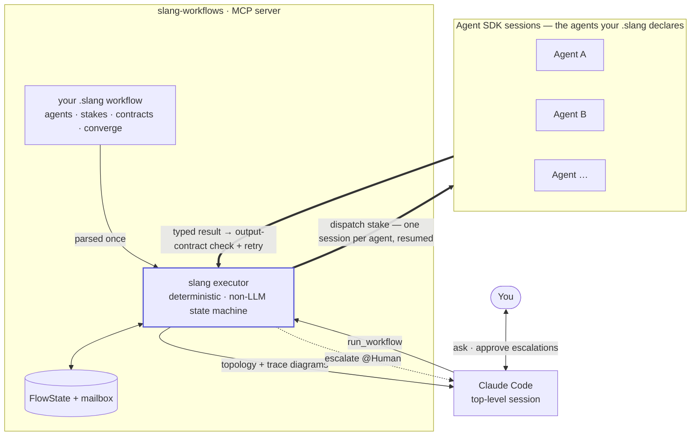

# slang-workflows

Run **provable**, `.slang`-driven **multi-agent workflows** inside Claude Code.

A non-LLM state machine (the *slang executor*) runs inside an MCP server and coordinates agents;
each agent is a Claude **Agent SDK** session. You declare the collaboration in a typed `.slang`
file and the executor *enforces* it — typed output contracts, static analysis, tool-scoping, and
provable termination — instead of leaving coordination to the model. The top-level Claude Code
session only *triggers* and *observes*; it never makes a coordination decision.

Claude Code's native **dynamic workflows** also codify orchestration (Claude writes a JS script);
slang's difference is that the structure is **enforced and statically analyzable**, and runs render
as **Mermaid topology + trace diagrams**. See the [benchmark](benchmark/) for the A/B/C head-to-head.

> **Origin.** The `.slang` Workflow engine was born in [**Shofer**](https://shofer.dev) — the
> AI-agent VS Code extension — where the deterministic, non-LLM executor was first built. This
> plugin brings it to Claude Code.

> Design and rationale: [`DESIGN.md`](DESIGN.md). Language reference: [`slang_specs.md`](slang_specs.md). Privacy: [`PRIVACY.md`](PRIVACY.md).

## How it works



The top-level Claude Code session only **triggers and observes** — it never makes a coordination
decision. The non-LLM **executor** reads your `.slang` file, dispatches each *stake* to an Agent
SDK session (one long-lived session per agent, resumed across rounds), checks every result against
its **output contract** (retrying on failure), routes it through the **mailbox**, and repeats each
round until the workflow's `converge` condition or round budget is met. Runs render as Mermaid
**topology** and **trace** diagrams; `escalate @Human` surfaces back to you in the normal chat.

## Use cases

Concrete workflows (each is a `.slang` file you run with `run_workflow`):

- **Implement a feature with a human design-approval gate** (`implement-feature.slang`) — an *Architect*
  decomposes your request and writes the design doc, but is scoped so it **physically cannot write code**
  (`write_paths: ["**/*.md"]`, `deny: [Bash]`) and must delegate. You approve the design (`escalate @Human`),
  then a *Developer* implements it slice-by-slice while a *Reviewer* signs off each round, with a final
  review gate before it commits.
- **Ship a feature as separate, verified deliverables** (`implement-feature-complex.slang`) — a linear
  Design → Implement → Test → Review → Document pipeline where five specialists each produce **one** artifact
  (the implementation, a *passing* vitest spec, usage docs) and can't do another's job — so code, tests, and
  docs actually match the design. Converges only when every stage has committed.
- **Troubleshoot a bug with two independent investigators** (`debug.slang`) — paste the symptom/repro; two
  developers root-cause it **in parallel, strictly read-only** (no accidental edits), an *Orchestrator*
  consolidates their independent findings into one fix plan, one developer implements it, and the other
  **peer-reviews the fix in a loop** until satisfied.
- **A reviewer that can inspect but never edit** — give the review agent `read`/`execute` and no write
  scope, so a "check my work" run can run tests and read code but cannot alter it — enforced, not just prompted.

## Features

- **Reproducible multi-agent pipelines** — the collaboration is codified in a `.slang` file and driven by a
  deterministic (non-LLM) executor, so a run unfolds the same way every time — no improvised, unrepeatable
  subagent coordination.
- **Enforced per-agent tool-scoping** — `write_paths` restricts each agent's Write/Edit to path globs and
  `deny` removes tools (e.g. `Bash`), enforced via the SDK's `canUseTool` — not merely requested in a prompt.
- **Static analysis before running** — `validate_workflow` detects deadlocks, unknown references, and
  orphaned outputs at parse time, before any tokens are spent.
- **Typed output contracts** — each stake must return a structurally *and* semantically valid result
  (`output: {…} where <expr>`); invalid results retry instead of silently propagating downstream.
- **Provable termination** — round budgets (`budget: rounds(N)`) + per-stake timeouts guarantee every run finishes.
- **Auto-generated diagrams** — every run renders a Mermaid topology (`get_topology`) and a sequence-diagram
  trace (`get_trace`), for live or post-mortem inspection.
- **Convergence-driven collaboration** — agents route via mailboxes and iterate until a declared convergence
  condition or budget is reached, with session resume so an agent keeps its context across rounds.

## How this differs from Claude Code's native *dynamic workflows*

Claude Code already has a built-in **dynamic workflows** feature: when a task needs orchestration, Claude
writes a **JavaScript script** (via the Agent SDK / `Workflow` tool) that spawns and coordinates subagents.
That's a real step up from improvised, one-off subagent calls — the script codifies the orchestration and,
once written, runs deterministically and coordinates for ~0 extra LLM cost. slang shares those goals; our
[benchmark](benchmark/) shows **both** approaches reach real, working implementations with near-zero
coordination-LLM cost. **The difference is what the orchestration *is*, and what's *guaranteed* about it:**

| | Native dynamic workflows | slang-workflows |
|---|---|---|
| The orchestration is… | an **LLM-authored JavaScript** script | a **typed, declarative `.slang`** file run by a fixed non-LLM executor |
| Who wrote the coordination logic | Claude, per task, in a general-purpose language | you (or an LLM, once) in a domain-specific language the runtime understands |
| Output contracts between stages | whatever the script happens to check | **enforced** by the runtime — structural + semantic (`output: {…} where <expr>`); invalid → retry |
| Per-agent tool scoping | up to the script | **enforced** — `write_paths` / `deny` via the SDK's `canUseTool` |
| Correctness of the structure | nothing checks the JS | **static analysis before running** — deadlock / unknown-ref / orphan-output |
| Termination | up to the script | **provable** — `budget: rounds(N)` + per-stake timeouts |
| Observability | instrument it yourself | **auto-generated** Mermaid topology + sequence-diagram trace |
| The reusable artifact | a script the model regenerates each time | a **versioned `.slang` file** + a fixed interpreter |

In short: native dynamic workflows put the orchestration in **LLM-written code you have to trust**; slang
puts it in a **typed declaration the runtime validates and enforces** — analyzable *before* it runs, scoped
and contract-checked *while* it runs, and rendered as diagrams *after*. Reach for slang when you want
**guarantees and auditability** (safety-scoped agents, provable termination, contract-valid hand-offs, a
reusable versioned workflow), not just "the model coordinated some subagents this time." Both are far better
than unstructured subagents — slang trades a bit of up-front declaration for enforcement and repeatability.

## What works today

- Discover / validate / run `.slang` workflows — **authored or LLM-generated inline** (MCP tools below).
- Deterministic executor: stake → **output-contract** validation + retry → mailbox routing →
  convergence; **multi-agent** flows; **session resume** (one agent = one session across stakes);
  `escalate @Human`.
- **Output contracts**: structural (`output: {...}`, via SDK `outputFormat`) + semantic (`where <expr>`).
- **Enforced tool scoping**: `write_paths` (Write/Edit restricted to path globs, via a PreToolUse
  command hook) and `deny` (remove native or MCP tools).
- **Static analysis** (`validate_workflow`): deadlock / unknown-ref / orphan-output detection before running.
- **Provable termination**: `budget: rounds(N)` + per-stake timeouts — the run always finishes.
- **Diagrams**: `get_topology` (Mermaid flowchart) + `get_trace` (Mermaid sequence + event log).
- **Synchronous or background** runs (`background:true`) with live polling of state/topology/trace.

See [`DESIGN.md` § Implementation Status](DESIGN.md#implementation-status) for the full matrix.

## Requirements

- **Node.js 22+** and **pnpm**.
- **Claude Code** installed and authenticated (the `claude` CLI on your `PATH`) — the Agent SDK
  spawns it to run agents.

## Install

```bash
cd server
pnpm install
```

> **Agent SDK note.** `@anthropic-ai/claude-agent-sdk` is declared as an *optional* dependency
> because some internal registries don't mirror it. If `pnpm install` skips it, add it from the
> public registry:
>
> ```bash
> pnpm add @anthropic-ai/claude-agent-sdk --registry=https://registry.npmjs.org/
> ```
>
> The server *parses/validates* workflows without it; *running* agents requires it.

Verify the install:

```bash
pnpm typecheck   # type-checks the whole server
pnpm test        # runs the unit suite (mock-based, no model calls)
```

## Use it

At runtime the server discovers `.slang` files in **your project's** `.claude/workflows/` (and
`~/.claude/workflows/`) — that's the user's space for their own workflows. The plugin ships
showcase workflows in [`server/test/fixtures/`](server/test/fixtures); copy them in to try them:

```bash
mkdir -p .claude/workflows
cp /PATH/TO/slang-orchestrator/server/test/fixtures/*.slang .claude/workflows/
```

### Quickest: register the MCP server with Claude Code

From the project whose `.claude/workflows/` you want to run:

```bash
claude mcp add slang-workflows -- npx tsx /ABSOLUTE/PATH/TO/slang-orchestrator/server/src/main.ts
```

Then in Claude Code, ask it to use the tools — e.g. *"list the slang workflows"*, *"run the
where-clause workflow"*.

### As a Claude Code plugin

This directory is a self-contained plugin: [`.claude-plugin/plugin.json`](.claude-plugin/plugin.json)
+ [`.mcp.json`](.mcp.json) (a stdio server launched as `npx tsx ${CLAUDE_PLUGIN_ROOT}/server/src/main.ts`).
Install it through Claude Code's plugin mechanism to expose the tools automatically.

## MCP tools

| Tool | Purpose |
|------|---------|
| `list_workflows` | Discover `.slang` files (name, title, params, agent count). |
| `get_slang_grammar` | Concise grammar cheatsheet + example, so an LLM can **generate** a workflow to run inline. |
| `validate_workflow` | Parse + static analysis (deadlocks, unknown refs, orphan outputs) without running. Accepts a `name`/`path` **or** inline `source`. |
| `run_workflow` | Run a workflow by `name`/`path` **or** inline `source` (rejects parse/static-analysis errors first). Synchronous by default; `background:true` returns a `workflow_id` immediately to poll live. |
| `get_workflow_state` | Serialized `FlowState` (per-agent status, round, budget) by `workflow_id` — live during a `background` run. |
| `get_topology` | Run topology as a Mermaid **flowchart** (status-colored snapshot) by `workflow_id`. |
| `get_trace` | Execution **trace** as a Mermaid **sequenceDiagram** + raw event log (who staked/routed to whom, commits, escalations, terminal) by `workflow_id`. |

**Generate-and-run loop:** `get_slang_grammar` → author slang → `validate_workflow{source}` → `run_workflow{source, background:true}` → poll `get_topology` / `get_trace` while it runs. The workflow is authored by an LLM but **executed deterministically** (contracts enforced, always terminates). `@Human` escalation works in synchronous runs only (interactive elicitation needs the tool call to stay open).

## Develop

```bash
pnpm dev        # run the server over stdio (logs to stderr)
pnpm typecheck  # tsc --noEmit
pnpm test       # node:test suite
```

The executor depends only on a `Dispatcher` interface; `FakeDispatcher` makes the whole VM
testable without the Agent SDK or any model calls (see [`server/test/`](server/test)).

## Layout

```
.claude-plugin/plugin.json   plugin manifest
.mcp.json                    stdio MCP server declaration
server/
  src/
    main.ts                  MCP server + tool surface
    constants.ts             tunable defaults in one place (round cap, retry budget, stake timeout, loop guard)
    executor.ts              deterministic round loop + output contracts
    dispatcher.ts            Dispatcher interface + FakeDispatcher (the agent-runtime seam)
    agent-sdk-dispatcher.ts  production backend (Claude Agent SDK)
    tool-group-map.ts        slang tool-groups → Claude Code tools
    workflows.ts             .slang discovery + validation
    slang/                   vendored, framework-agnostic slang VM (lexer/parser/interpreter/…)
  test/                      node:test unit + conformance suite
    fixtures/                showcase .slang workflows (also the conformance fixtures)
```

## License

MIT.
